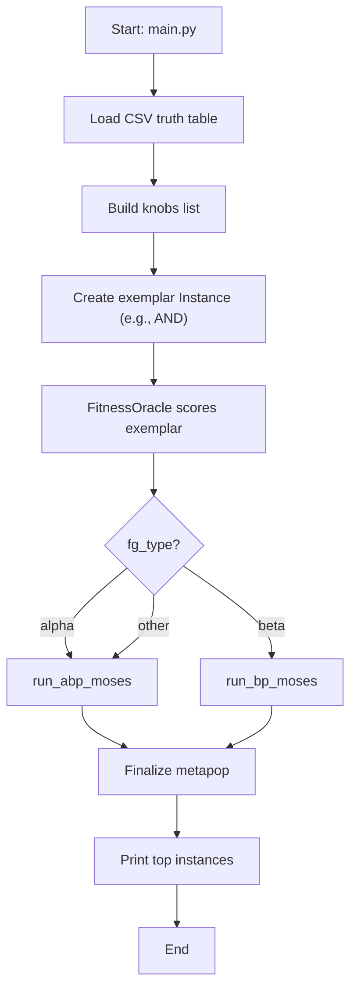
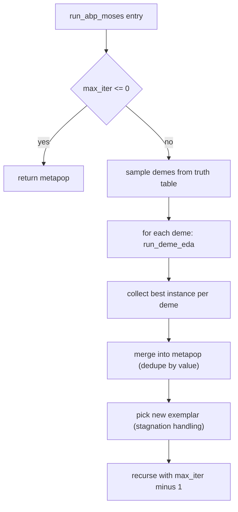
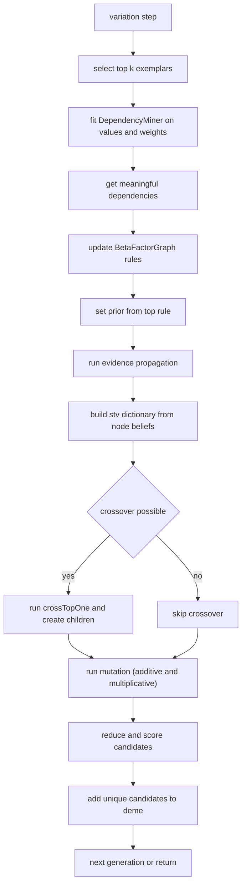
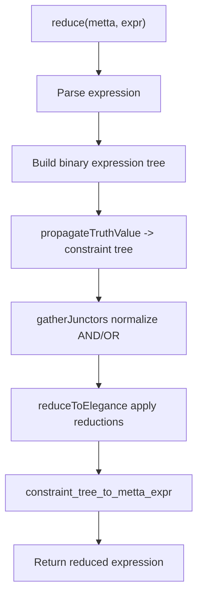

## 1) End-to-end flow charts

### 1.1 Overall system flow (main.py → strategy)

### 1.2 Alpha path (ABP MOSES + EDA per deme)

### 1.3 Beta path (BP-guided variation inside deme)

### 1.4 ENF reduction pipeline (reduct/enf)

---

